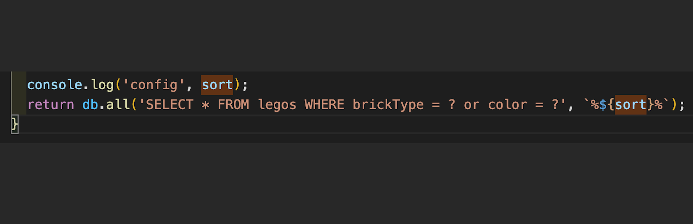

# LEGO SHOP

<!-- functional requirement

non functional requirement

using vanilla js in frontend i.e CSS, HTML and JavaScript

using node and SQLite in the server -->

## Overview

## DevDependencies and installations

* ```npm i```
* Even though ```npm i``` will install all the dependencies needed, the list of the dependencies below are the npm packages used throughout the development process.
  * ```npm i http-server```
  * ```npm i express```
  * ```npm i -g nodemon```
  * ```npm i sqlite@3.0.6```
  * ```npm i fs```
  * ```npm i path```
  * ```npm i uuid```
  * ```npm install --save multer```

After installing all the dependencies to start the server, it can be done by running:

* ```npm start``` or
* ```nodemon server/svr.js```

## Key Features and Functionalilty (need to discuss all app.put)

need to explain how a user can't see wishlist, design and checkout button

### API

* list all bricks, sorted bricks, kits and videos from the database.
* specify a brick or kit from the database.
* see below

### Management

* This is managed in git(private repo).

## API and Documentation

* /bricks
  * GET: retrieve all the bricks from the database.
  * PUT:
* /bricks/:sort
  * GET: retrieves list of sorted bricks
* /brick
  * GET: retrieve a brick from the database.
* /kits
  * GET: retrieve all the kits from the database.
* /kit
  * GET: retrieve a kit from the database.
* /videos
  * GET: retrieve all the videos from the database. This is used for "coming soon feature in the homepage"
* /auth-config
    Serves auth0 configuration file
* redirect
    Handles any URL error. It redirects to 404error page.

## Reasons for a specific paradigm

| Paradigm used | Reasons for a specific paradigm |
|----| ----|
|Auth0| Auth0 provides functionality to ensure authorization and authentication using a passwordless login. The benefit of Auth0 is developer won't be worried about having to store user credentials in the database. Thus making the application more secured from attackers. Implementing |
|Multiple-page Application| Choosing between Single page and Multiple page in this coursework, i took some pros and cons into consideration. I started the intial development using a SPA because it is fast and are loaded once. SPA caches any local storage pretty well but, it is very tricky to manipulate the URLs and it's becomes slow especially when we have a lot of content on a page. I had issues with the history API. I swtiched my application to a multiple page as the URLs manipulation is easy even though SPA creates a better user experince. Also, it allows new pages for each lego and implementing any change to a specific page. if a JS file should fail not the whole app throws an error or crashes. |
|Sorting by price, type, and color| |
|Top picks and coming soon| Suggesting to a user some items is a good feature in a shopping website. |
|||
sorting??
why use redirect?
why i chose videos the way i did that's math.random

## Future Development

* Due to the lack of time, some features i desired to achieve were not implemented. If there was time i would have implemented search for inventories using array.filter to create a new array of inventories that matches the input.value of being entered.

* Wishlist: A new database file using HTTP request of POST. I already implemented that only if a user is logged in they can see the wish list tab. If i had created a database file for wish list, it will get a handler on the wish list button then, forEach lego being added to wish list it POST to the database. And also will display the OBJECT.value of that database file.

* Design Kit:

* Continue as guest:

### Known Issues

### Reference List

* LEGO Database Download <https://rebrickable.com/downloads/>
* RegEx for matching UK Postcodes
<https://stackoverflow.com/questions/164979/regex-for-matching-uk-postcodes>

*
*
*
*
*
*
*

<!--
 -->