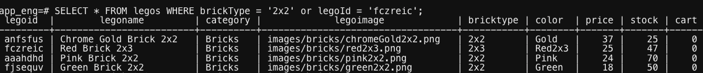
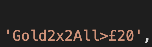
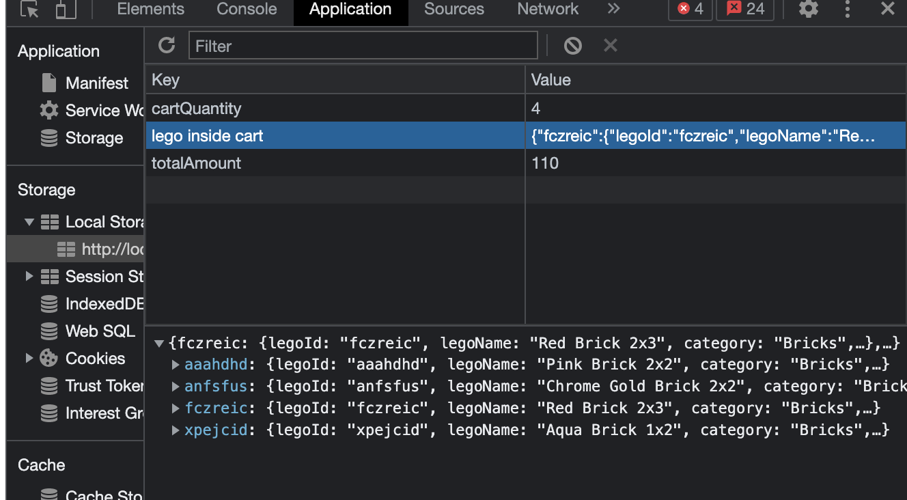
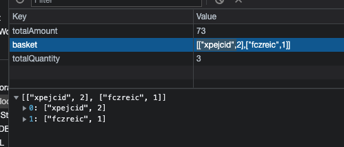
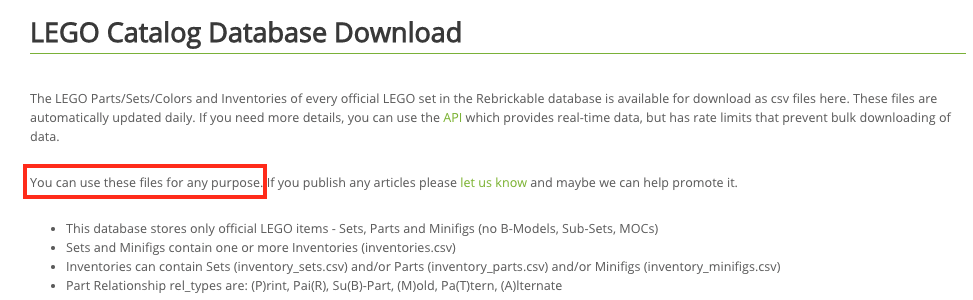

# LEGO SHOP

## Overview

## DevDependencies and installations

* ```npm i```
* Even though ```npm i``` will install all the dependencies needed, the list of the dependencies below are the npm packages used throughout the development process.
  * ```npm i express```
  * ```npm i -g nodemon```
  * ```npm i sqlite@3.0.6```
  * ```npm i fs```
  * ```npm i path```
  * ```npm i uuid```
  * ```npm install --save multer```
  * ```npm i uuid-random```
  * ```npm i --save-dev jest```
  * ```npm i node-fetch```

After installing all the dependencies to start the server, it can be done by running:

* ```npm start``` or
* ```nodemon server/svr.js```

## Key Features and Functionalilty

* filter by colour, type, size (there was no time that is why it wasn't implemented in the kits page). It only works in the bricks page
* Each brick and kit has its own web page with a unique URL
* Shopping cart
* Simulated checkout and updating stock levels after you enter payment information
* Maintaining an inventory of items for sale, and stock levels.
* Top picks for the customer
* Kits and bricks coming soon with a small advert
* Admin can upload a new brick only if logged in via auth0 (there was no time that is why it wasn't implemented in the kits page)
* customers can add items to their wishlist

### API

* list all bricks, sorted bricks, kits and videos from the database.
* specify a brick or kit from the database.
* Updates stocklevels
* see below

## API and Documentation

* /bricks
  * GET: retrieve all the bricks from the database.
  * POST: upload a brick
* /bricks/:sort
  * GET: retrieves list of sorted bricks
* /brick
  * GET: retrieve a brick from the database.
* /brick/:basket
  * PUT: updates the stocklevels in the database after a customer has made a purchase.
* /kits
  * GET: retrieve all the kits from the database.
* /kit
  * GET: retrieve a kit from the database.
* /videos
  * GET: retrieve all the videos from the database. This is used for "coming soon feature in the homepage"
* /auth-config
    Serves auth0 configuration file
* redirect
    Handles any URL error. It redirects to 404error page.
  
## Testing

### Management

* This is managed in git(private repo).

## Reasons for a specific paradigm

| Paradigm used | Reasons for a specific paradigm |
|----| ----|
|Auth0| Auth0 provides functionality to ensure authorization and authentication using a passwordless login. The benefit of Auth0 is developer won't be worried about having to store user credentials in the database. Thus making the application more secured from attackers. Implementing |
|Multiple-page Application| Choosing between Single page and Multiple page in this coursework, i took some pros and cons into consideration. I started the intial development using a SPA because it is fast and are loaded once. SPA caches any local storage pretty well but, it is very tricky to manipulate the URLs and it's becomes slow especially when we have a lot of content on a page. I had issues with the history API. I swtiched my application to a multiple page as the URLs manipulation is easy even though SPA creates a better user experince. Also, it allows new pages for each lego and implementing any change to a specific page. if a JS file should fail not the whole app throws an error or crashes. |
|Sorting by price, type, and color| There are two ways i approached sorting. First is by selecting two different columns and use "LIKE" and "OR" to check if the option clicked on the website is the same as the text in the database as shown in the image below. It worked when i tried it on the Uni VM but i couldn't get it to work on the website.  The other option i considered was to make another column which contains all the sorting options in the website and use "LIKE" to check if the option clicked matches any of the value within that database column.   This is an insufficient way in my opinion it would be better if i can select from two different column this is one of the things i need to improve in the future.|
|Top picks and coming soon| Suggesting to a user some items is a good feature in a shopping website. I fetched from the server kits, bricks and two videos and set the src to random. Suggestion for a website like this should not be guessable hence, why i set the src to be random.|
|Reason for using multiple database| I assumed that in the future when maintaining thousands of inventories it will be difficult if kits, bricks, and advert videos are in the same database file. Hence why i kept them in separate db files|
|Reason for including only the first letter of the name as profile| I realised when using auth0 when i login with google i can retrieve the username as we were taught in the authentication lecture. But whenever i login using email as password i.e. as a registered auth0 user it returns undefined hence, i decided to just get the first letter of just the email address and capitalize it.|
|why use 404.html for redirecting URL| If for example a user enters a wrong URL it should display a well designed error message. This can help users identify if a link is valid or not.|
|Reason for using SQLite|"SQLite is self-contained means it requires minimal support from the operating system or external library. SQLite is fast, which can be attributed to the fact that it is a lightweight DBMS with simple operations and minimal design. PostgreSQL may not be a suitable DBMS for running fast read queries. This can be attributed to its complex design and the fact that it is a heavy DBMS" (HEVO, 2021)|
|LocalStorage| There were two different approach i did for storing the bricks in the localstorage. The first approach was to store the whole brick object in the localstorage and create a column in the database and set it to zero then use that to count number of the brick on each addToCart.  But, it looks inefficient as there is no need of storing everything about a brick to the localstorage. The second approach was to store the id of the brick and it's quantity to the localstorage. This is efficient because we can access all the information about a brick from storing the id only. |
|Reason for using Jest framework| "It ensures that different tests don't influence each other's results. For Jest, tests are executed in parallel, each running in their own process. This means they can't interfere with other tests, and Jest acts as the orchestrator that collects the results from all the test processes." (testIM, 2022)|
|Why i tested API calls| APIs now serve as the primary interface to application logic and because GUI tests are difficult to maintain with the short release cycles and frequent changes commonly used with Agile software development and DevOps. If there is fetch failing API testing will reveal the bugs.|

### Assumptions

i am assuming that the person who logs in is an administrator. So they get the luxury to upload a new brick.
also, for the customer i assume they should have all the features required to checkout and buy a product without being forced to login.

## Known Issues and Errors

* couldn't figure out how to implement administrator authentication. At the moment any person who could login has administrator rights.

* Reason for not updating kits stock: i commented out the function (line 161-174 createBasket.mjs, line 73-99 legoConfig.mjs and line 53-61 svr.js) that updates kits stock because i couldn't figure out how to update a kit and brick at the same time.
If the function that was commented out is used it updates the kit's stock only if kit is in the cart. This is the same with brick, i believe bricks is core to the courswork that's why i am updating only bricks.

* Deleting from wishlist: i explain in wishlist.js line 118-120

* Couldn't figure out how to allow users add the number of quantity they want in the basket. It only works with plus or minus which is a bad usability if a customer wants to buy hundreds of bricks. They have to keep on click the plus button to add.

## Future improvements

* Displaying a message to the user if order is not placed

* The sorting of the bricks works properly but can be improved. It has been explained above in reasons for specific paradigm's section.

* Auth0 redirecting back to homepage. This is bad for usability, if there is time in the future i will check the auth0 library properly so that if a user logs in, it should redirect to the page they were in.

* Due to the lack of time, some features i desired to achieve were not implemented. If there was time i would have implemented search for inventories using array.filter to create a new array of inventories that matches the input.value being entered.

* If there was time similar to how i updload brick i would have allow the admin to delete bricks. Refrence to how it was done in wp_api.

* Wishlist: A new database file using HTTP request of POST. If i had created a database file for wish list, it will get a handler on the wish list button then, forEach lego being added to wish list it POST to the database. And also will display the OBJECT.value of that database file. At the moment the wishlist is being stored in the localStorage.

* Linking the kits to bricks so that it shows a customer the bricks needed to make a kit.

* Loyalty program and placing out of stock orders.

* Orders: creating an order page that displays to the customer the order they made

* Allowing a customer to design kit

* Moving items from wishlist to cart

### Reference List

* *LEGO CatalogDatabase Download*. (n.d.). Rebrickable. <https://rebrickable.com/downloads/>

Copyright information:


* *RegEx for matching UK Postcodes*. (2013, June 25). Stackoverflow. <https://stackoverflow.com/questions/164979/regex-for-matching-uk-postcodes>

* *ws_api*. (2019, November 26). Github. <https://github.com/portsoc/ws_api>
* *SQLite vs PostgreSQL: 8 Critical Differences*. (2021, May 18). HEVO <https://hevodata.com/learn/sqlite-vs-postgresql/#:~:text=SQLite%20is%20fast%2C%20which%20can,it%20is%20a%20heavy%20DBMS.>
* *simple-staged-message-board*. (2022, January 17). Github. <https://github.com/portsoc/staged-simple-message-board>

* *Jest Tesing: A Helpful, Introductory Tutorial*. (2022, Martch 25). testIM. <https://www.testim.io/blog/jest-testing-a-helpful-introductory-tutorial/>
